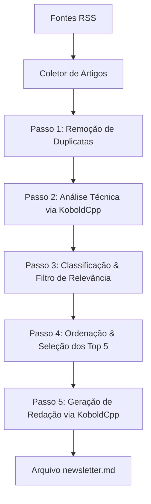

# 🤖 Agente IA Editorial de Newsletter Técnica

Este projeto implementa um **Agente de Inteligência Artificial** completo e modular que coleta artigos em tempo real de várias fontes RSS, realiza de-duplicação inteligente, avalia a relevância técnica de cada um para pessoas desenvolvedoras utilizando o LLM local **Qwen3-8B (via KoboldCpp / OpenAI API)**, e redige uma newsletter técnica polida e de alto valor prático.

---

## 📋 Requisitos e Arquitetura do Agente

O agente foi construído seguindo rigorosamente os passos fundamentais de um pipeline de curadoria de conteúdo inteligente:



### Funcionalidades Implementadas:
1. **Coleta de RSS Multi-fonte:** Coleta e normaliza informações estruturadas de 3 fontes padrão para desenvolvedores (*Hacker News*, *Dev.to*, *TechCrunch Developer*).
2. **Deduplicação Inteligente:** Sanitiza os links (removendo queries tracking) e normaliza textualmente os títulos de forma a remover repetições e artigos equivalentes.
3. **Agente Editorial IA (Classificador e Validador):** Cada artigo é enviado individualmente ao KoboldCpp através da API OpenAI solicitando uma análise de categorização (`Notícia`, `Tutorial`, `Promoção`, `Outro`) e pontuação de relevância técnica (1 a 10) baseando-se no impacto de engenharia de software, retornando em JSON estrito.
4. **Filtro de Relevância:** Descarta promoções, propagandas ordinárias e fofocas corporativas, focando estritamente em **notícias que sejam de relevância prática** para os desenvolvedores.
5. **Ordenação e Top 5:** Os artigos filtrados são ordenados de forma decrescente pela relevância atribuída pela IA, e as 5 principais histórias são passadas para o redator.
6. **Redator Criativo (Geração de Newsletter):** Um prompt refinado de redação orquestra o LLM local para assumir a persona de um Editor-Chefe, criando uma introdução sobre o ecossistema tecnológico, resumindo o conteúdo das 5 matérias, linkando para cada fonte original e fechando com um encerramento simpático e inteligente em português.

---

## 🚀 Como Executar o Agente em Dev Containers (Recomendado 🔒)

O projeto inclui um o ambiente multi-container usando **Docker Compose** e **Dev Containers** (da Microsoft) totalmente configurado com:
- O container da aplicação (`app`), onde o código Python roda de forma isolada.
- O container do model server (`koboldcpp`), que roda focado em CPU e gerencia o carregamento de forma inteligente.

### Passo 1: Colocar o modelo localmente
Coloque o seu arquivo de modelo local no formato GGUF dentro da pasta `models/` nomeado exatamente como `Qwen3-8B.gguf`:
`./models/Qwen3-8B.gguf`

### Passo 2: Reabrir no Container
1. **Abra o projeto no VS Code**.
2. Certifique-se de que a extensão **Dev Containers** (da Microsoft) esteja instalada.
3. Quando solicitado pelo VS Code, clique em **"Reopen in Container"** (Reabrir no Container) ou use a Paleta de Comandos (`Ctrl+Shift+P` -> `Dev Containers: Reopen in Container`).
4. O VS Code construirá o ambiente de desenvolvimento e conectará você no container da aplicação de forma totalmente isolada. 
5. O container do `koboldcpp` aguardará o modelo de forma inteligente e servirá a API na porta `5001`.

### Passo 3: Rodar o Agente
No terminal integrado do devcontainer, basta rodar:
```bash
python main.py
```

---

### Opção B: Usando o Ambiente Python Local

### 1. Iniciar o Ollama Local
Certifique-se de que o serviço do Ollama esteja ativo em seu sistema operacional. No terminal, você pode iniciar com:
```bash
ollama serve
```

Com o serviço rodando, confirme que você possui o modelo local instalado. Nas suas configurações locais, nós identificamos que você já possui o modelo **`qwen3.5:4b`** instalado, o qual utilizaremos por padrão. Caso queira baixar ou testar outro modelo:
```bash
ollama pull qwen3.5:4b
```

### 2. Ativar o Ambiente Virtual
O ambiente Python conda `copa` já está totalmente configurado e as seguintes dependências já foram instaladas com sucesso:
- `feedparser` (leitor de feeds RSS)
- `ollama` (SDK oficial do Ollama)
- `pydantic` (validação e tipagem de dados)
- `jinja2` (mecanismo de renderização de strings/templates)

Para executar os scripts, use o comando Python do seu ambiente diretamente, eliminando qualquer risco de conflito global:
```bash
/home/teo/anaconda3/envs/copa/bin/python main.py
```

### 3. Argumentos Personalizáveis
Você pode alterar o modelo local, o endereço de rede do Ollama ou o arquivo de destino utilizando os argumentos de linha de comando:
```bash
# Executa usando o modelo qwen3.5:9b (que também está disponível na sua máquina!)
/home/teo/anaconda3/envs/copa/bin/python main.py --model qwen3.5:9b --output minha_newsletter.md
```

---

## 📂 Estrutura dos Arquivos do Projeto

- **[config.py](config.py):** Arquivo de configurações centrais do agente. Nele você pode alterar as fontes RSS padrão ou mudar o modelo padrão.
- **[rss_parser.py](rss_parser.py):** Concentra a leitura do RSS pelo `feedparser` e implementa a rotina de de-duplicação que remove strings não alfanuméricas para evitar redundâncias que burlam comparadores simples de strings.
- **[ollama_client.py](ollama_client.py):** Gerencia a interface de comunicação de baixo nível com o daemon do Ollama, forçando saídas em formato JSON para garantir a consistência das classificações feitas pela IA.
- **[agent.py](agent.py):** Inteligência de classificação profunda. Define as regras de categorização e os limiares de relevância para desenvolvedores.
- **[newsletter.py](newsletter.py):** Faz o papel do Editor-Chefe literário. Ele coleta os dados refinados pelo Agente e monta o corpo da Edição do dia no formato Markdown.
- **[main.py](main.py):** Script orquestrador central executável por linha de comando.
- **[requirements.txt](requirements.txt):** Dependências do projeto para replicação em outros ambientes.

---

## 📈 Exemplo Prático de Execução

Ao rodar o comando, o terminal imprimirá um log detalhado de cada fase da curadoria:

```text
[15:10:02] INFO - === INICIANDO AGENTE DA NEWSLETTER ===
[15:10:02] INFO - Modelo LLM configurado: 'qwen3.5:4b'

--- PASSO 1: Coleta RSS ---
[15:10:02] INFO - Coletando feed de: https://news.ycombinator.com/rss
[15:10:03] INFO - Coletando feed de: https://dev.to/feed
[15:10:04] INFO - Coletando feed de: https://techcrunch.com/category/developer/feed/

--- PASSO 2: Remoção de Duplicadas ---
[15:10:04] INFO - Coleta finalizada: 85 coletados, 78 únicos após deduplicação.

--- PASSO 3: Inicializando IA local (Ollama) ---
[15:10:04] INFO - OllamaClient inicializado com modelo: qwen3.5:4b no host: http://localhost:11434

--- PASSO 4: Classificação, Filtragem e Ordenação pelo Agente Editorial IA ---
[15:10:04] INFO - Processando artigo 1/78
[15:10:06] INFO - Analisando artigo: 'Python 3.13.1 Released with Experimental Free-Threaded Build' via qwen3.5:4b
...
[15:11:32] INFO - Filtragem completa: 78 analisados -> 22 classificados como notícias relevantes.
[15:11:32] INFO - Seleção final pronta com 5 artigos selecionados.

=== DETALHES DOS 5 ARTIGOS SELECIONADOS PELO AGENTE ===
[1] Python 3.13.1 Released with Experimental Free-Threaded Build
    Fonte: Hacker News | Categoria: Notícia | Relevância: 10/10
    Link: https://news.ycombinator.com/item?id=...
    Justificativa Editorial: Modificação fundamental no interpretador removendo o GIL. Extremamente impactante para desenvolvimento concorrente em Python.
...

--- PASSO 5: Redigindo Newsletter Final via IA ---
[15:11:32] INFO - Gerando texto da newsletter...

--- PASSO 6: Gravando Newsletter em Arquivo ---
[15:11:55] INFO - Newsletter salva com sucesso em 'newsletter.md'!
[15:11:55] INFO - === AGENTE EXECUTADO COM SUCESSO! ===
```

Fique à vontade para inspecionar e usufruir de sua nova newsletter autogerada de alta qualidade técnica! 🚀
